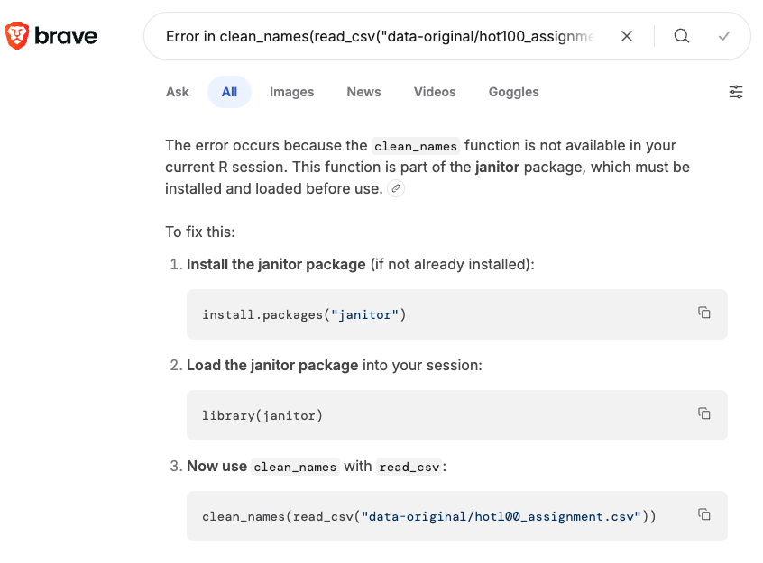
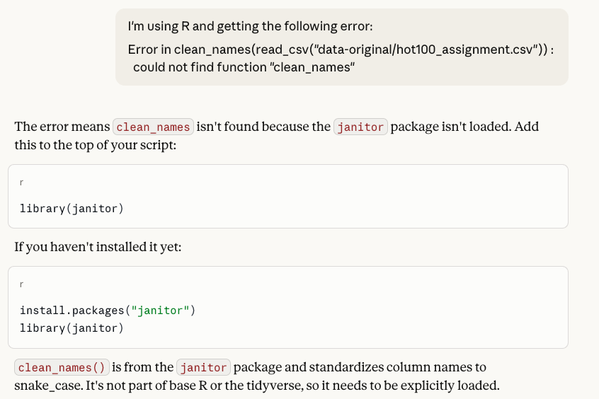
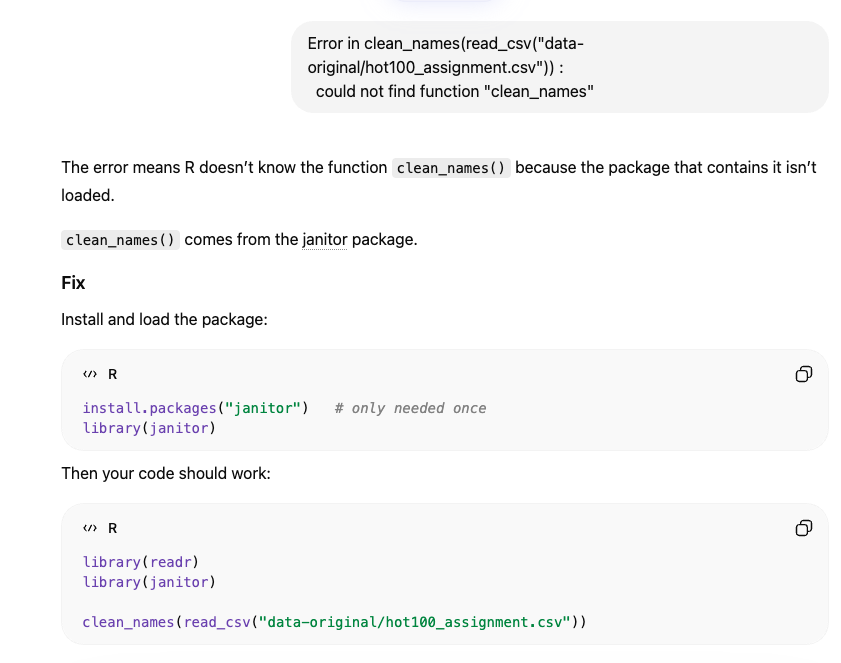
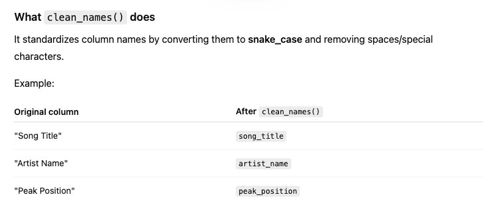
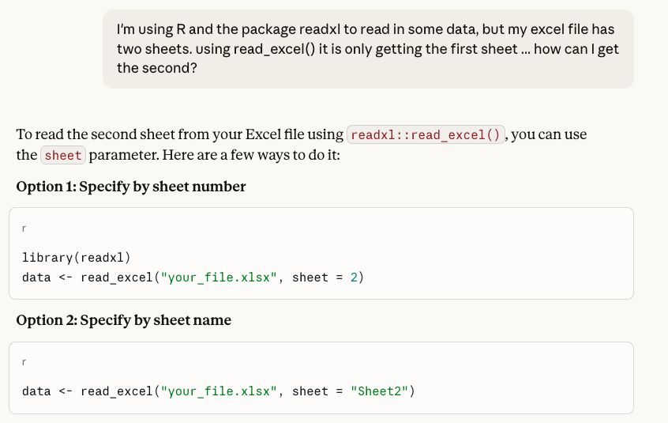

## Troubleshooting with Chat

Here I want to show how you can take an error and try to find out what is going on with a basic GenAI chat experience.

```{r}
#| label: setup
#| message: false
#| warning: false

library(tidyverse)
```


```{r}
#| eval: false

read_csv("data-original/hot100_assignment.csv") |> clean_names()
```

### Browsers

You can try copy/pasting the error into a browser for the AI or Google answer

```text
Error in clean_names(read_csv("data-original/hot100_assignment.csv")) : 
  could not find function "clean_names"
```



### Chat interfaces

Or you could do similar with ChatGPT, Claude or ChatGPT

#### Claude answer



#### ChatGPT



### Read the context

In this last instance, ChatGPT went on to give some background about what the package does. This is that extra bit that people who use AI as a crutch instead of a tool fail to get the full benefit.

(The crazy thing is it derived the variables from context or a previous chat because I didn't supply that.)




### Provide a good prompt

It might help to say you are using R or Tidyverse and a package you might need.



You might even provide the data. There is a package called [datapasta](https://milesmcbain.github.io/datapasta/) that can help you make a reproducible sample of your data. I used `datapasta::dpaste` to format the tibble below. This is also useful if you are asking for help on a forum like Stack Overflow.

```markdown
I have the following data in R:

tibble::tribble(
  ~year, ~district, ~name, ~party, ~candvotes,
  "2016", 46, "Dukes", "D", 37457,
  "2016", 46, "Greeley", "G", 2178,
  "2016", 46, "Ludlow", "L", 3445,
  "2016", 46, "Nila", "R", 10209
)

And I want new columns that do the following:

- the name of the winning candidate (highest candvotes value).
- the percentage of the total vote that the winning candidate received
- the name of the second highest candidate (using candvotes)
- the percentage of the total vote that second candidate got
- the difference betwen the two percentages

```

You can see the full exchange of the [above prompt here](https://chatgpt.com/share/69b31c88-995c-8009-82f4-8b599b9144c4).


